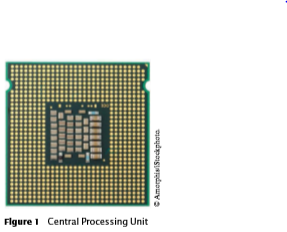
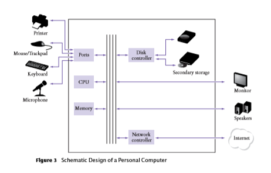
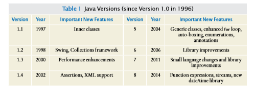
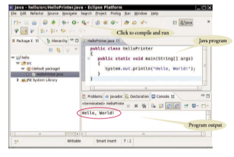
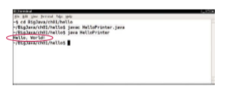
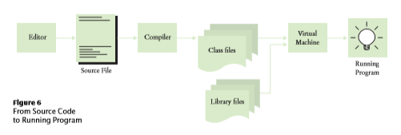
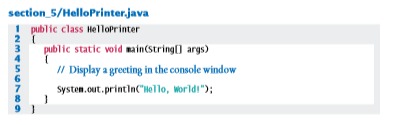
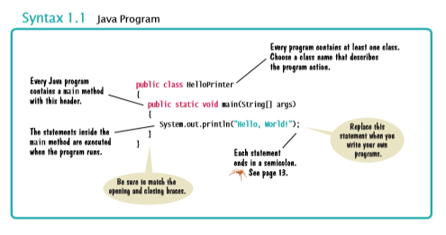
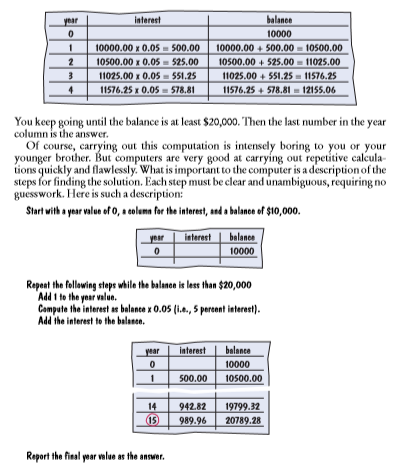

#### Nama : Nurhaliza
#### NIM  : 2110131120007

## BAB 1 PENGANTAR

#### 1.1 Program Komputer

*You have probably used a computer for work or fun. Many people use computers for everyday tasks such as electronic banking or writing a term paper. Computers are good for such tasks. They can handle repetitive chores, such as totaling up numbers or placing words on a page, without getting bored or exhausted.*

Anda mungkin pernah menggunakan komputer untuk bekerja atau bersenang-senang. Banyak orang menggunakan komputer untuk tugas sehari-hari seperti perbankan elektronik atau menulis makalah. Komputer adalah baik untuk tugas-tugas seperti itu. Mereka dapat menangani tugas berulang, seperti menjumlahkan angka atau menempatkan kata-kata di halaman, tanpa merasa bosan atau lelah.

*The flexibility of a computer is quite an amazing phenomenon. The same machine can balance your checkbook, lay out your term paper, and play a game. In contrast, other machines carry out a much nar rower range of tasks; a car drives and a toaster toasts. Computers can carry out a wide range of tasks because they execute different programs, each of which directs the computer to work on a specific task.*

Fleksibilitas komputer adalah fenomena yang cukup menakjubkan. Mesin yang sama dapat menyeimbangkan buku cek Anda, meletakkan kertas istilah Anda, dan bermain game. Sebaliknya, mesin lain melakukan berbagai tugas yang jauh lebih sempit; mobil yang dikendarai dan pemanggang roti bersulang. Komputer dapat melakukan berbagai tugas karena mereka menjalankan tugas yang berbeda program, yang masing-masing mengarahkan komputer untuk bekerja pada tugas tertentu.

*The computer itself is a machine that stores data (numbers, words, pictures), interacts with devices (the monitor, the sound system, the printer), and executes programs. A computer program tells a computer, in minute detail, the sequence of steps that are needed to fulfill a task. The physical computer and periph eral devices are collectively called the hardware. The programs the computer executes are called the soft ware.*

Komputer itu sendiri adalah mesin yang menyimpan data (angka, kata-kata, gambar), berinteraksi dengan perangkat (monitor, sistem suara, printer), dan menjalankan program. Sebuah program komputer memberi tahu komputer, secara rinci, urutan langkah-langkah yang diperlukan untuk memenuhi tugas. Komputer fisik dan perangkat periferal secara kolektif disebut perangkat keras. Program yang dijalankan komputer disebut barang lunak.

*Today’s computer programs are so sophisticated that it is hard to believe that they are composed of extremely primitive instructions. A typical instruction may be one of the following:*

* put a red dot at agiven screen position.
* Add up two numbers.
* If the value is negative*

Program komputer saat ini sangat canggih sehingga sulit dipercaya bahwa mereka terdiri dari instruksi yang sangat primitif. Instruksi tipikal mungkin satu dari berikut ini:

* Letakkan titik merah pada posisi layar tertentu.
* Tambahkan dua angka.
* Jika nilai ini negatif, lanjutkan program pada instruksi tertentu.

*The computer user has the illusion of smooth interaction because a program contains a huge number of such instructions, and because the computer can execute them at great speed.* 

*The act of designing and implementing computer programs is called programming. In this book, you will learn how to program a computer—that is, how to direct the computer to execute tasks.*

Pengguna komputer memiliki ilusi interaksi yang lancar karena sebuah program berisi sejumlah besar instruksi semacam itu, dan karena komputer dapat mengeksekusinya di kecepatan luar biasa.

Tindakan merancang dan mengimplementasikan program komputer disebut pemrograman. Dalam buku ini, Anda akan belajar cara memprogram komputer yaitu cara mengarahkan komputer untuk menjalankan tugas.

*To write a computer game with motion and sound effects or a word processor that supports fancy fonts and pictures is a complex task that requires a team of many highly-skilled programmers. Your first programming efforts will be more mundane. The concepts and skills you learn in this book form an important foundation, and you should not be disappointed if your first programs do not rival the sophis ticated software that is familiar to you. Actually, you will find that there is an immense thrill even in sim ple programming tasks. It is an amazing experience to see the computer precisely and quickly carry out a task that would take you hours of drudgery, to make small changes in a program that lead to immediate improvements, and to see the computer become an extension of your mental powers.*

Untuk menulis game komputer dengan efek gerakan dan suara atau pengolah kata yang mendukung font dan gambar mewah adalah tugas kompleks yang membutuhkan tim yang terdiri dari banyak orang programmer yang sangat terampil. Upaya pemrograman pertama Anda akan lebih biasa.Konsep dan keterampilan yang Anda pelajari dalam buku ini membentuk fondasi penting, dan Anda tidak boleh kecewa jika program pertama Anda tidak menyaingi sophis ticated perangkat lunak yang akrab bagi Anda. Sebenarnya, Anda akan menemukan bahwa ada sensasi yang luar biasa bahkan dalam tugas pemrograman sederhana. Ini adalah pengalaman yang luar biasa untuk melihat komputerdengan tepat dan cepat melaksanakan tugas yang akan memakan waktu berjam-jam kerja keras, untuk membuat perubahan kecil dalam program yang mengarah pada perbaikan segera, dan untuk melihat komputer menjadi perpanjangan dari kekuatan mental Anda.

1. What is required to play music on a computer? 
1. Why is a CD player less flexible than a computer? 
2. What does a computer user need to know about programming in order to play a video game?

.

1. Apa yang di perlukan untuk memainkan music pada komputer?
2. Mengapa pemutar CD kurang fleksibel dari pada komputer?
3. apa yang pengguna komputer perlu ketahui tentang programming untuk memainkan video game?

#### 1.2 Anatomi Komputer

*To understand the programming process, you need to have a rudimentary understanding of the building blocks that make up a computer. We will look at a personal computer. Larger computers have faster, larger, or more powerful components, but they have fundamentally the same design.*

Untuk memahami proses pemrograman, Anda harus memiliki pemahaman dasar dari blok bangunan yang membentuk komputer. Kami akan melihat secara pribadi komputer. Komputer yang lebih besar memiliki komponen yang lebih cepat, lebih besar, atau lebih kuat, tetapimereka pada dasarnya memiliki desain yang sama.

*At the heart of the computer lies the central processing unit (CPU) (see Figure 1). The inside wiring of the CPU is enormously complicated. For example, the Intel Core processor (a popular CPU for per sonal computers at the time of this writing) is composed of several hundred million structural elements, called transistors.*

    

Di jantung komputer terletak pusatnyaunit pemrosesan (CPU) (lihat Gambar 1). Bagian dalam pengkabelan CPU sangat rumit.Misalnya, prosesor Intel Core (yang populerCPU untuk per komputer pribadi pada saat initulisan) terdiri dari beberapa ratus juta elemen struktural, yang disebut transistor.

*The CPU performs program control and data processing. That is, the CPU locates and executes the program instructions; it carries out arithmetic operations such as addition, subtraction, multiplication, and division; it fetches data from external memory or devices and places processed data into storage. There are two kinds of storage.*

CPU melakukan kontrol program dan data pengolahan. Artinya, CPU menempatkan dan mengeksekusi instruksi program; itu melaksanakan operasi aritmatika seperti penjumlahan, pengurangan,perkalian, dan pembagian; itu mengambil datadari memori eksternal atau perangkat dan tempat data yang diproses ke dalam penyimpanan.

*There are two kinds of storage. Primary storage, or memory, is made from electronic circuits that can store data, provided they are supplied with electric power. Secondary storage, usually a hard disk (see Figure 2) or a solid-state drive, provides slower and less expensive storage that persists without electricity. A hard disk consists of rotating platters, which are coated with a mag netic material. A solid-state drive uses electronic components that can retain information without power, and without moving parts.*

Ada dua macam penyimpanan. Penyimpanan utama,atau memori, dibuat dari sirkuit elektronik yang dapat menyimpan data, asalkan:disuplai dengan tenaga listrik. Penyimpanan sekunder, biasanya hard disk (lihat Gambar 2)atau solid-state drive, menyediakan penyimpanan yang lebih lambat dan lebih murah yang bertahan tanpa listrik. Sebuah hard disk terdiri dari piringan berputar, yang dilapisi dengan magnetnbahan. Solid-state drive menggunakan komponen elektronik yang dapat menyimpan informasitanpa daya, dan tanpa bagian yang bergerak.

*To interact with a human user, a computer requires peripheral devices. The computer transmits infor mation (called output) to the user through a display screen, speakers, and printers. The user can enter information (called input) for the computer by using a keyboard or a pointing device such as a mouse.*

Untuk berinteraksi dengan pengguna manusia, komputer membutuhkan perangkat periferal. Komputer mentransmisikan informasi (disebut output) kepada pengguna melalui layar tampilan, speaker, dan printer. Pengguna dapat memasukkan informasi (disebut input) untuk komputerdengan menggunakan keyboard atau alat penunjuk seperti mouse.

*Some computers are self-contained units, whereas others are interconnected through networks. Through the network cabling, the computer can read data and programs from central storage locations or send data to other computers. To the user of a networked computer, it may not even be obvious which data reside on the computer itself and which are transmitted through the network. *

Beberapa komputer adalah unit mandiri, sedangkan yang lain saling berhubungan melalui jaringan. Melalui kabel jaringan, komputer dapat membaca data dan program dari lokasi penyimpanan pusat atau mengirim data ke komputer lain. Untuk penggunadari komputer jaringan, bahkan mungkin tidak jelas data mana yang berada di komputeritu sendiri dan yang ditransmisikan melalui jaringan.

*Figure 3 gives a schematic overview of the architecture of a personal computer. Program instructions and data (such as text, numbers, audio, or video) reside in secondary storage or elsewhere on the network. When a program is started, its instructions are brought into memory, where the CPU can read them. The CPU reads and executes one instruction at a time. As directed by these instructions, the CPU reads data, modifies it, and writes it back to memory or secondary storage. Some program instruc tions will cause the CPU to place dots on the display screen or printer or to vibrate the speaker. As these actions happen many times over and at great speed, the human user will perceive images and sound. Some program instructions read user input from the keyboard, mouse, touch sensor, or microphone. The program analyzes the nature of these inputs and then executes the next appropriate instruction.*

    

Gambar 3 memberikan gambaran skematis arsitektur komputer pribadi. Instruksi dan data program (seperti teks, angka, audio, atau video) berada di sekunder penyimpanan atau di tempat lain di jaringan. Ketika sebuah program dimulai, instruksinyadibawa ke memori, di mana CPU dapat membacanya. CPU membaca dan mengeksekusi satu instruksi pada suatu waktu. Seperti yang diarahkan oleh instruksi ini, CPU membacadata, memodifikasinya, dan menulisnya kembali ke memori atau penyimpanan sekunder. Beberapa programinstruksi akan menyebabkan CPU menempatkan titik-titik pada layar tampilan atau printer atau kegetaran speakernya. Karena tindakan ini terjadi berkali-kali dan dengan kecepatan tinggi,pengguna manusia akan melihat gambar dan suara. Beberapa instruksi program membaca penggunamasukan dari keyboard, mouse, sensor sentuh, atau mikrofon. Analisis programsifat input ini dan kemudian mengeksekusi instruksi yang sesuai berikutnya.

4. Where is a program stored when it is not currently running? 
5. Which part of the computer carries out arithmetic operations, such as addition and multiplication? 
6. A modern smartphone is a computer, comparable to a desktop computer. Which components of a smartphone correspond to those shown in Figure 3?

4. Dimana program di simpan ketika sedang tidak dipakai?
5. Bagian komputer mana yang membawa operasi aritmarika, seperti pertambahan dan perkalian?
6. smartphone modern adalah komputer, dibandingkan dengan komputer desktop. Komponen smartphone mana yang berhubungan dengan yang di gambarkan pada gambar 3?

#### *komputasi dan masyarakat 1.1*

#### *computing & society 1.1*

*When computers were first invented in the 1940s, a computer filled an entire room. The photo below shows the ENIAC (electronic numerical integrator and computer), completed in 1946 at the University of Pennsylvania. The ENIAC was used by the military to compute the trajectories of projectiles. Nowadays, computing facilities of search engines, Internet shops, and social networks fill huge buildings called data centers. At the other end of the spectrum, computers are all around us. Your cell phone has a computer inside, as do many credit cards and fare cards for public transit. A modern car has several computers––to control the engine, brakes, lights, and the radio.*  

Ketika komputer pertama kali ditemukan pada tahun 1940-an, komputer memenuhi seluruh ruangan.  Foto di bawah menunjukkan ENIAC (integrator numerik elektronik dan komputer), selesai pada tahun 1946 di University of Pennsylvania.  ENIAC digunakan oleh militer untuk menghitung lintasan proyektil.  Saat ini, fasilitas komputasi mesin pencari, toko internet, dan jejaring sosial memenuhi gedung-gedung besar yang disebut pusat data.  Di ujung lain spektrum, komputer ada di sekitar kita.  Ponsel Anda memiliki komputer di dalamnya, seperti halnya banyak kartu kredit dan kartu tarif untuk angkutan umum.  Sebuah mobil modern memiliki beberapa komputer––untuk mengontrol mesin, rem, lampu, dan radio.  

*The advent of ubiquitous computing changed many aspects of our lives. Factories used to employ people to do repetitive assembly tasks that are today carried out by computercontrolled robots, operated by a few people who know how to work with those computers. Books, music, and movies nowadays are often consumed on computers, and computers are almost always involved in their production. The book that you are reading right now could not have been written without computers.*

Munculnya komputasi di mana-mana berubah banyak aspek dari kami hidup.  Pabrik digunakan mempekerjakan orang untuk lakukan perakitan berulang tugas-tugas yang hari ini dilakukan oleh komputer- robot yang dikendalikan, operasi dimakan oleh segelintir orang siapa yang tahu caranya bekerja dengan komputer.  Buku, musik, dan film saat ini sering dikonsumsi di komputer, dan komputer hampir selalu terlibat dalam produksi mereka.  Buku yang sedang Anda baca sekarang tidak mungkin ditulis tanpa komputer. 

*Knowing about computers and how to program them has become an essential skill in many careers. Engineers design computer-controlled cars and medical equipment that preserve lives. Computer scientists develop programs that help people come together to support social causes. For example, activists used social networks to share videos showing abuse by repressive regimes, and this information was instrumental in changing public opinion.*

Mengetahui tentang komputer dan cara memprogramnya telah menjadi keterampilan penting dalam banyak karier.  Insinyur merancang mobil yang dikendalikan komputer dan peralatan medis yang menyelamatkan nyawa.  Ilmuwan komputer mengembangkan program yang membantu orang berkumpul untuk mendukung tujuan sosial.  Misalnya, para aktivis menggunakan jejaring sosial untuk berbagi video yang menunjukkan pelecehan oleh rezim yang represif, dan informasi ini berperan penting dalam mengubah opini publik.

*As computers, large and small, become ever more embedded in our everyday lives, it is increasingly important for everyone to understand how they work, and how to work with them. As you use this book to learn how to program a computer, you will develop a good understanding of computing fundamentals that will make you a more informed citizen and, perhaps, a computing professional.*

Ketika komputer, besar dan kecil, menjadi semakin tertanam dalam kehidupan kita sehari-hari, semakin penting bagi setiap orang untuk memahami cara kerjanya, dan cara bekerja dengannya.  Saat Anda menggunakan buku ini untuk mempelajari cara memprogram komputer, Anda akan mengembangkan pemahaman yang baik tentang dasar-dasar komputasi yang akan membuat Anda menjadi warga negara yang lebih berpengetahuan dan, mungkin, seorang profesional komputasi.

#### 1.3 Bahasa Pemrograman Java

*In order to write a computer program, you need to provide a sequence of instructions that the CPU can execute. A computer program consists of a large number of simple CPU instructions, and it is tedious and error-prone to specify them one by one. For that reason, high-level programming languages have been created. In a high-level language, you specify the actions that your program should carry out. A compiler translates the high-level instructions into the more detailed instructions (called machine code)required by the CPU. Many different programming languages have been designed for different purposes.*

Untuk menulis program komputer, Anda perlu memberikan urutan instruksi yang dapat dieksekusi oleh CPU. Sebuah program komputer terdiri dari sejumlah besar program instruksi CPU sederhana, dan membosankan juga rawan untuk kesalahan untuk menentukannya satu persatu. Karena alasan itu, bahasa pemrograman tingkat tinggi telah dibuat. Dalam bahasa tingkat tinggi, Anda menentukan tindakan yang harus dilakukan programnya. Penyusun menerjemahkan instruksi tingkat tinggi ke dalam instruksi yang lebih rinci (disebut kode mesin) yang dibutuhkan oleh CPU. Banyak bahasa pemrograman yang berbeda telah dirancang untuk tujuan yang berbeda.

*In 1991, a group led by James Gosling and Patrick Naughton at Sun Microsystems designed a programming language, code-named “Green”, for use in consumer devices, such as intelligent television “set-top” boxes. The language was designed to be simple, secure, and usable for many dif ferent processor types. No customer was ever found for this technology.*

Pada tahun 1991, sebuah kelompok yang dipimpin oleh James Gosling dan Patrick Naughton di Sun Microsystems merancang sebuah bahasa pemrograman, berkode nama “Green”, untuk kegunaan di perangkat konsumen, seperti “set-top” televisi cerdas. Bahasanya dirancang untuk sederhana, aman, dan dapat digunakan oleh berbagai tipe prosesor yang berbeda. Tidak ada pelanggan yang pernah ditemukan untuk teknologi ini.

*Gosling recounts that in 1994 the team realized, “We could write a really cool browser. It was one of the few things in the client/server main stream that needed some of the weird things we’d done: architecture neu tral, real-time, reliable, secure.” Java was introduced to an enthusiastic crowd at the SunWorld exhibition in 1995, together with a browser that ran applets—Java code that can be located anywhere on the Internet. The figure at right shows a typical example of an applet.* 

Gosling menceritakan pada tahun 1994 tim menyadari “Kita bisa menulis browser yang sangat keren. Itu adalah salah satu dari sedikit hal dalam arus utama klien/server yang membutuhkan beberapa hal aneh yang telah kami lakukan: arsitektur netral, waktu nyata, andal, aman.” Java diperkenalkan kepada orang banyak yang antusias di pameran SunWorld pada tahun 1995, bersama dengan browser yang menjalankan applet—kode Java yang dapat ditemukan di mana saja di Internet. Gambar di sebelah kanan menunjukkan contoh khas applet.
 
*Since then, Java has grown at a phenomenal rate. Programmers have embraced the language because it is easier to use than its closest rival, C++. In addition, Java has a rich library that makes it possible to write portable programs that can bypass proprietary operating systems—a feature that was eagerly sought by those who wanted to be independent of those proprietary systems and was bitterly fought by their ven dors. A “micro edition” and an “enterprise edition” of the Java library allow Java programmers to target hardware ranging from smart cards to the largest Internet servers.*

Sejak saat itu, Java telah berkembang dengan kecepatan yang fenomenal. Programmer telah menggunakan bahasa ini karena lebih mudah digunakan daripada saingan terdekatnya, C++. Selain itu, Java memiliki perpustakaan yang kaya yang memungkinkan untuk menulis program portabel yang dapat melewati sistem operasi berpemilik—fitur yang sangat dicari oleh mereka yang ingin menjadi independen dari sistem berpemilik tersebut dan diperjuangkan dengan sengit oleh vendor mereka.

*Because Java was designed for the Internet, it has two attributes that make it very suitable for begin ners: safety and portability.*

    

Karena Java dirancang untuk internet, ia mempunyai dua atrbut yang membuatnya sangat cocok untuk pemula: keamanan dan portabilitas.

*Java was designed so that anyone can execute programs in their browser without fear. The safety features of the Java language ensure that a program is terminated if it tries to do something unsafe. Having a safe environment is also helpful for anyone learning Java. When you make an error that results in unsafe behavior, your program is terminated and you receive an accurate error report.*

Java dirancang sehingga siapapun dapat menjalankan program di browser mereka tanpa takut. Fitur keamanan bahasa Java memastikan program dihentikan apabila mencoba untuk melakukan sesuatu membahayakan. Memiliki lingkungan yang aman juga membantu bagi siapapun yang mempelajari Java. Disaat Anda melakukan error yang mengakibatkan perilaku membahayakan, program Anda dihentikan dan Anda menerima laporan eror yang akurat.

*The other benefit of Java is portability. The same Java program will run, without change, on Windows, UNIX, Linux, or Macintosh. In order to achieve portability, the Java compiler does not translate Java programs directly into CPU instructions. Instead, compiled Java programs contain instructions for the Java virtual machine, a program that simulates a real CPU. Portability is another benefit for the begin ning student. You do not have to learn how to write programs for different platforms.*

Manfaat lain dari Java adalah portabilitas. Program Java yang sama akan jalan, tanpa perubahan, pada Windows, UNIX, Linux, atau Macintosh. Untuk mencapai portabilitas, penyusun Java tidak menerjemahkan program-program Java langsung ke dalam instruksi CPU. Melainkan, program Java yang tersusun memuat instruksi untuk mesin virtual Java, sebuah program yang menyimulasikan CPU nyata. Portabilitas adalah manfaat lain untuk murid pemula. Anda tidak harus belajar bagaimana cara menulis program untuk platform yang berbeda.

*At this time, Java is firmly established as one of the most important languages for general-purpose pro gramming as well as for computer science instruction. However, although Java is a good language for beginners, it is not perfect, for three reasons.*

Saat ini, Java telah ditetapkan sebagai salah satu bahasa yang paling penting untuk pemrograman umum serta untuk instruksi ilmu komputer. Namun, meskipun Java adalah bahasa yang baik untuk pemula, tapi tidak sempurna, karena tiga alasan.

*Because Java was not specifically designed for students, no thought was given to making it really sim ple to write basic programs. A certain amount of technical machinery is necessary to write even the simplest programs. This is not a problem for professional programmers, but it can be a nuisance for beginning students. As you learn how to program in Java, there will be times when you will be asked to be satisfied with a preliminary explanation and wait for more complete detail in a later chapter.*

Karena Java tidak dirancang khusus untuk siswa, tidak ada pemikiran yang diberikan untuk membuatnya sangat sederhana untuk menulis program dasar. Sejumlah mesin teknis diperlukan untuk menulis bahkan program yang paling sederhana. Hal ini bukan masalah bagi programmer profesional, tetapi bisa menjadi gangguan bagi pelajar pemula. Saat Anda mempelajari caranya untuk memprogram di Java, akan ada saatnya Anda akan diminta untuk puas dengan penjelasan awal dan menunggu detail yang lebih lengkap di bab selanjutnya.

*Java has been extended many times during its life—see Table 1. In this book, we assume that you have Java version 7 or later.*

Java telah diperpanjang berkali-kali selama masa pakainya—lihat Table 1. Dalam buku ini, kami menganggap bahwa Anda memiliki Java versi 8 atau yang lebih baru.

*Finally, you cannot hope to learn all of Java in one course. The Java language itself is relatively simple, but Java contains a vast set of library packages that are required to write useful programs. There are pack ages for graphics, user-interface design, cryptography, networking, sound, database storage, and many other purposes. Even expert Java programmers cannot hope to know the contents of all of the packages— they just use those that they need for particular projects.*

Pada akhirnya, Anda tidak dapat berharap untuk mempelajari keseluruhan dari Java dalam satu pembelajaran. Bahasa Java itu sendiri relatif sederhana, tapi Java berisi sekumpulan library packages yang diperlukan untuk menulis program yang berguna. Ada paket untuk grafik, desain antarmuka pengguna, kriptografi, jaringan, suara, penyimpanan basis data, dan banyak kegunaan lainnya. Bahkan programmer Java yang ahli sekalipun tidak dapat berharap untuk mengetahui isi semua paket—mereka hanya menggunakan yang mereka perlukan untuk proyek tertentu.

*Using this book, you should expect to learn a good deal about the Java language and about the most important packages. Keep in mind that the central goal of this book is not to make you memorize Java minutiae, but to teach you how to think about programming.*

Dengan  menggunakan buku ini, Anda diharapkan untuk belajar banyak tentang bahasa Java dan tentang paket yang paling penting. Camkan selalu bahwa tujuan utama dari buku ini bukan untuk Anda mengingat detail kecil Java, tapi untuk mengajari Anda cara berpikir tentang pemrograman.

7. What are the two most important benefits of the Java language? 
8. How long does it take to learn the entire Java library?

7. Apa dua keuntungan penting dari bahasa Java?
8. Berapa lama yang diperlukan untuk mempelajari seluruh perpustakaan Java?

#### 1.4 Menjadi Familiar dengan Lingkungan Pemrograman Anda

*Many students find that the tools they need as programmers are very different from the software with which they are familiar. You should spend some time making yourself familiar with your programming environment. Because computer systems vary widely, this book can only give an outline of the steps you need to follow. It is a good idea to participate in a hands-on lab, or to ask a knowledgeable friend to give you a tour.*

    

Banyak siswa menemukan bahwa alat yang mereka butuhkan sebagai pemrogram sangat berbeda dari perangkat lunak yang mereka kenal. Anda harus meluangkan waktu untuk membiasakan diri dengan lingkungan pemrograman Anda. Karena sistem komputer sangat bervariasi, buku ini hanya dapat memberikan garis besar langkah-langkah yang perlu Anda ikuti. Merupakan ide bagus untuk Anda berpartisipasi dalam lab praktik, atau meminta teman yang berpengetahuan luas untuk memberi Anda penjelasan.

*Step 1 Start the Java development environment.*

*Computer systems differ greatly in this regard. On many computers there is an integrated development environment in which you can write and test your programs. On other computers you first launch an editor, a program that functions like a word processor, in which you can enter your Java instructions; you then open a console window and type commands to execute your program. You need to find out how to get started with your environment.*

Langkah 1 Mulai lingkungan pengembangan Java.

Sistem komputer sangat berbeda dalam hal ini. Pada banyak komputer terdapat lingkungan pengembangan terintegrasi di mana Anda dapat menulis dan menguji program Anda. Di komputer Anda pertama kali meluncurkan editor, sebuah program yang berfungsi seperti pengolah kata, di mana Anda dapat memasukkan instruksi Java Anda; Anda kemudian membuka jendela konsol dan ketik perintah untuk menjalankan program Anda. Anda perlu mencari tahu bagaimana memulai dengan lingkungan Anda.
 

*Step 2 Write a simple program.*

*The traditional choice for the very first program in a new programming language is a program that dis plays a simple greeting: “Hello, World!”. Let us follow that tradition. Here is the “Hello, World!” pro gram in Java:*

    public class HelloPrinter {
        public static void main(String[] args){
            System.out.println("Hello, World!");
        } 
    } 

*No matter which programming environment you use, you begin your activity by typing the program statements into an editor window.*

Langkah2 Tulis sebuah program yang sederhana.

Pilihan tradisional untuk program pertama dalam bahasa pemrograman baru adalah program yang menampilkan sapaan sederhana: “Halo, Dunia!”. Mari kita ikuti tradisi itu. Inilah "Halo, Dunia!" program di java:

    public class HelloPrinter {
        public static void main(String[]args){
            System.out.println("Hello,World!");
        }
    }

Apa pun lingkungan pemrograman yang Anda gunakan, Anda memulai aktivitas Anda dengan mengetikkan pernyataan program ke dalam jendela editor.

*Create a new file and call it HelloPrinter.java, using the steps that are appropriate for your environ ment. (If your environment requires that you supply a project name in addition to the file name, use the name hello for the project.) Enter the program instructions exactly as they are given above. Alternatively, locate the electronic copy in this book’s companion code and paste it into your editor.*

    

Buat file baru dan beri namaHelloPrinter.java, menggunakan langkah-langkah yang sesuai untuk lingkungan Anda. (Jika lingkungan Anda mengharuskan Anda memberikan nama proyek selain nama file, gunakan namahello untuk proyek tersebut.) Masukkan instruksi program persis seperti yang diberikan di atas. Atau, temukan salinan elektronik dalam kode pendamping buku ini dan tempelkan ke editor Anda.

*As you write this program, pay careful attention to the various symbols, and keep in mind that Java is case sensitive. You must enter upper- and lowercase letters exactly as they appear in the program listing. You cannot type MAIN or PrintLn. If you are not careful, you will run into problems—see Common Error 1.2 on page 15.*

Saat Anda menulis program ini, perhatikan baik-baik berbagai simbol, dan ingatlah bahwa Java sensitif terhadap huruf besar-kecil. Anda harus memasukkan huruf besar dan kecil persis seperti yang muncul dalam daftar program. Anda tidak dapat mengetikMAIN atauPrintLn. Jika Anda tidak hati-hati, Anda akan mengalami masalah—lihat Kesalahan Umum 1.2.

*Step 3 Run the program.* 

*The process for running a program depends greatly on your programming environment. You may have to click a button or enter some commands. When you run the test program, the message* 

Hello, World! 

*will appear somewhere on the screen (see Figures 4 and 5).*

Langkah 3 Jalankan programnya.
 
Proses untuk menjalankan program sangat bergantung pada lingkungan pemrograman Anda. Anda mungkin harus mengklik tombol atau memasukkan beberapa perintah. Saat Anda menjalankan program pengujian, pesannya.

Hello,World!

akan muncul di suatu tempat di layar (lihat Gambar 4 dan Gambar 5).

*In order to run your program, the Java compiler translates your source files (that is, the statements that you wrote) into class files. (A class file contains instructions for the Java virtual machine.) After the compiler has translated your source code into virtual machine instructions, the virtual machine executes them. During execution, the virtual machine accesses a library of pre-written code, including the implementations of the System and PrintStream classes that are necessary for displaying the program’s output. Figure 6 summarizes the process of creating and running a Java program. In some programming environments, the compiler and virtual machine are essentially invisible to the programmer—they are automatically executed whenever you ask to run a Java program. In other environments, you need to launch the compiler and virtual machine explicitly.* 

Untuk menjalankan program Anda, kompiler Java menerjemahkan file sumber Anda (yaitu, pernyataan yang Anda tulis) ke dalam file kelas. (Sebuah file kelas berisi instruksi untuk mesin virtual Java.) Setelah kompilator menerjemahkan kode sumber Anda ke dalam instruksi mesin virtual, mesin virtual akan mengeksekusinya. Selama eksekusi, mesin virtual mengakses pustaka kode yang telah ditulis sebelumnya, ermasuk implementasi kelasSystem danPrintStream yang diperlukan untuk menampilkan keluaran program. Gambar 6 merangkum proses membuat dan menjalankan program Java. Di beberapa lingkungan pemrograman, kompilator dan mesin virtual pada dasarnya tidak terlihat oleh pemrogram—mereka dijalankan secara otomatis setiap kali Anda meminta untuk menjalankan program Java. Di lingkungan lain, Anda perlu meluncurkan kompiler dan mesin virtual secara eksplisit.

*Step 4 Organize your work.* 

*As a programmer, you write programs, try them out, and improve them. You store your programs in files. Files are stored in folders or directories. A folder can contain Java files as well as other folders, which themselves can contain more files and folders (see Figure 7). This hierarchy can be quite large, and you need not be concerned with all of its branches. However, you should create folders for organizing your work. It is a good idea to make a separate folder for your programming coursework. Inside that folder, make a separate folder for each program.*

    

Langkah 4 Rapikan pekerjaamu.

Sebagai seorang programmer, Anda menulis program, mencobanya, dan memperbaikinya. Anda menyimpan program Anda dalam file. File disimpan dalam folder atau direktori. Sebuah folder dapat berisi file serta folder lain, yang dengan sendirinya dapat berisi lebih banyak file dan folder 
(lihat Gambar 7). Hirarki ini bisa sangat besar, dan Anda tidak perlu khawatir dengan semua cabangnya. Namun, Anda harus membuat folder untuk mengatur pekerjaan Anda. Sebaiknya buat folder terpisah untuk pro-tugas mata kuliah tata bahasa. Di dalam folder itu, buat folder terpisah untuk setiap program.

*Some programming environments place your programs into a default location if you don’t specify a folder yourself. In that case, you need to find out where those files are located.*

Beberapa lingkungan pemrograman menempatkan program Anda ke lokasi default jika Anda tidak menentukan folder sendiri. Dalam hal ini, Anda perlu mencari tahu di mana file-file itu berada.

*Be sure that you understand where your files are located in the folder hierarchy. This information is essential when you submit files for grading, and for making backup copies (see Programming Tip 1.1).*

Pastikan Anda memahami di mana file Anda berada dalam hierarki folder. Informasi ini penting ketika Anda mengirimkan file untuk penilaian, danuntukmembuat salinan cadangan (lihat Tip Pemrograman 1.1). 

9. Where is the HelloPrinter.java file stored on your computer?
10. What do you do to protect yourself from data loss when you work on programming projects?

9. Dimana berkas HelloPrinter.java disimpan di komputer anda?
10. apa yang anda lakukan untuk menjaga anda dari kehilangan data ketika anda bekerja dalam projek programming?

#### Programming Tip 1.1

**Backup Copies**

*You will spend many hours creating and improving Java programs. It is easy to delete a file by accident, and occasionally files are lost because of a computer malfunction. Retyping the contents of lost files is frustrating and time-consuming. It is therefore crucially impor tant that you learn how to safeguard files and get in the habit of doing so before disaster strikes. Backing up files on a memory stick is an easy and convenient storage method for many people. Another increasingly popular form of backup is Internet file storage. Here are a few pointers to keep in mind:*

Anda akan menghabiskan banyak waktu untuk membuat dan meningkatkan program Java. Sangat mudah untuk menghapus file secara tidak sengaja, dan terkadang file hilang karena kerusakan komputer. Mengetik ulang konten file yang hilang membuat frustrasi dan memakan waktu. Oleh karena itu, sangat penting bagi Anda untuk mempelajari cara melindungi file dan membiasakannya jikamelakukannya sebelum bencana terjadi. Mencadangkan file di memoristick adalah metode penyimpanan yang mudah dan nyaman bagi banyak orang. Bentuk pencadangan lain yang semakin populer adalah penyimpanan file Internet. Berikut adalah beberapa petunjuk yang perlu diingat: 

* _Back up often. Backing up a file takes only a few seconds, and you will hate yourself if you have to spend many hours recreating work that you could have saved easily. I rec ommend that you back up your work once every thirty minutes_
* _Rotate backups. Use more than one directory for backups, and rotate them. That is, first back up onto the first directory. Then back up onto the second directory. Then use the third, and then go back to the first. That way you always have three recent backups. If your recent changes made matters worse, you can then go back to the older version._
* _Pay attention to the backup direction. Backing up involves copying files from one place to another. It is important that you do this right—that is, copy from your work location to the backup location. If you do it the wrong way, you will overwrite a newer file with an older version._
* _Check your backups once in a while. Double-check that your backups are where you think they are. There is nothing more frustrating than to find out that the backups are not there when you need them._
* _Relax, then restore. When you lose a file and need to restore it from a backup, you are likely to be in an unhappy, nervous state. Take a deep breath and think through the recovery process before you start. It is not uncommon for an agitated computer user to wipe out the last backup when trying to restore a damaged file._

* Sering-seringlah membuat cadangan. Mencadangkan file hanya membutuhkan beberapa detik, dan Anda akan membenci diri sendiri jika harus menghabiskan banyak waktu untuk membuat ulang pekerjaan yang sebenarnya bisa Anda simpan dengan mudah. Saya sarankan Anda mencadangkan pekerjaan Anda setiap tiga puluh menit sekali.
* Putar cadangan. Gunakan lebih dari satu direktori untuk cadangan, dan putar mereka. Artinya, back up dulu ke direktori pertama. Kemudian kembali ke direktori kedua. Kemudian gunakan yang ketiga, lalu kembali ke yang pertama. Dengan begitu Anda selalu memiliki tiga cadangan terbaru. Jika perubahan terbaru Anda memperburuk keadaan, Anda dapat kembali ke versi yang lebih lama.
* Perhatikan arah pencadangan. Pencadangan melibatkan penyalinan file dari satu tempat ke tempat lain. Anda harus melakukannya dengan benar—yaitu, menyalin dari lokasi kerja Anda ke lokasi pencadangan. Jika Anda melakukannya dengan cara yang salah, Anda akan menimpa file yang lebih baru dengan versi yang lebih lama.
* Periksa cadangan Anda sesekali. Periksa kembali apakah cadangan Anda berada di tempat yang Anda pikirkan. Tidak ada yang lebih membuat frustrasi daripada mengetahui bahwa cadangan tidak ada saat Anda membutuhkannya.
* Santai, lalu pulihkan. Saat Anda kehilangan file dan perlu memulihkannya dari cadangan, kemungkinan besar Anda berada dalam keadaan gelisah dan tidak bahagia. Ambil napas dalam-dalam dan pikirkan proses pemulihan sebelum Anda mulai. Bukan hal yang aneh bagi pengguna komputer yang gelisah untuk menghapus cadangan terakhir ketika mencoba memulihkan file yang rusak.

#### 1.5 Analyzing Your First Program

*In this section, we will analyze the first Java program in detail. Here again is the source code:*

    

*The line*

*public class HelloPrinter indicates the declaration of a class called HelloPrinter.*

*Every Java program consists of one or more classes. We will discuss classes in more detail in Chapters 2 and 3*. 

*The word public denotes that the class is usable by the “public”. You will later encounter private features.*

Pada bagian ini, kita akan menganalisis program Java pertama secara rinci. Di sini adalah kode sumber.

Garis

public class HelloPrinter menunjukkan deklarasi kelas yang disebut HelloPrinter

Setiap program Java terdiri dari satu atau lebih kelas. Kita akan membahas kelas secara lebih rinci di Bab 2 dan 3.

Kata publik menunjukkan bahwa kelas dapat digunakan oleh "publik". Anda kemudian akan menemukan fitur pribadi.

*In Java, every source file can contain at most one public class, and the name of the public class must match the name of the file containing the class. For example, the class HelloPrinter must be contained in a file named HelloPrinter.java.*

The construction

    public static void main(String[] args) {
        . . . 
    } 

Di Java, setiap file sumber dapatberisi paling banyak satu kelas publik, dan nama kelas publik harus sesuai dengan nama file yang berisi kelas tersebut. Misalnya, kelas HelloPrinter harus dimuat dalam file bernama HelloPrinter.java.

The construction

    public static void main(String[] args) {
        . . . 
    } 

*declares a method called main. A method contains a collection of programming instructions that describe how to carry out a particular task. Every Java application must have a main method. Most Java programs contain other methods besides main, and you will see in Chapter 3 how to write other methods.*

mendeklarasikan metode yang disebut main. Metode berisi kumpulan instruksi pemrograman yang menjelaskan bagaimana melakukan tugas tertentu. Setiap aplikasi Java harus memiliki metode utama. Sebagian besar program Java berisi metode lain selain utama, dan Anda akan melihat di Bab 3 cara menulis metode lain.

*The term static is explained in more detail in Chapter 8, and the meaning of String[] args is covered in Chapter 11. At this time, simply consider*

    public class ClassName {
        public static void main(String[] args){
            . . .
        }
    }

Istilah statis dijelaskan secara lebih rinci dalam Bab 8, dan arti dari String[ ] args dibahas dalam Bab 11. Pada saat ini, cukup pertimbangkan.

*The main method contains one or more instructions called statements. Each statement ends in a semi colon ( ; ). When a program runs, the statements in the main method are executed one by one.*

    

Metode main berisi satu atau lebih instruksi yang disebut pernyataan. Setiap pernyataan diakhiri dengan titik koma ( ; ). Ketika sebuah program dijalankan,

*In our example program, the main method has a single statement:* 

    System.out.println("Hello, World!"); 

*This statement prints a line of text, namely “Hello, World!”. In this statement, we call a method which, for reasons that we will not explain here, is specified by the rather long name System.out.println.*

Dalam contoh program kita, metode utama memiliki satu pernyataan:

    System.out.println("Hello, World!");

Pernyataan ini mencetak sebaris teks, yaitu “Hello, World!”. Dalam pernyataan ini, kita memanggil metode yang, untuk alasan yang tidak akan kita jelaskan di sini, ditentukan dengan nama System.out.println yang agak panjang.

*We do not have to implement this method—the programmers who wrote the Java library already did that for us. We simply want the method to perform its intended task, namely to print a value.*

Kita tidak harus mengimplementasikan metode ini—programmer yang menulis library Java sudah melakukannya untuk kita. Kita hanya ingin metode melakukan tugas yang dimaksudkan, yaitu mencetak nilai.

*Whenever you call a method in Java, you need to specify*

1. _The method you want to use (in this case, System.out.println)._
2. _Any values the method needs to carry out its task (in this case, "Hello, World!"). The technical term for such a value is an argument. Arguments are enclosed in parentheses. Multiple arguments are sep arated by commas._

Setiap kali Anda memanggil metode di Java, Anda perlu menentukan

1. Metode yang ingin Anda gunakan (dalam hal ini, System.out.println).
2. Nilai apa pun yang dibutuhkan metode untuk menjalankan tugasnya (dalam hal ini, "Hello, World!"). Istilah teknis untuk nilai seperti itu adalah argumen. Argumen diapit dalam tanda kurung. Beberapa argumen dipisahkan dengan koma.

*A sequence of characters enclosed in quotation marks*

"Hello, World!"

*is called a string. You must enclose the contents of the string inside quotation marks so that the compiler knows you literally mean "Hello, World!". There is a reason for this requirement. Suppose you need to print the word main. By enclosing it in quotation marks, "main", the compiler knows you mean the sequence of characters m a i n, not the method named main. The rule is simply that you must enclose all text strings in quotation marks, so that the compiler considers them plain text and does not try to inter pret them as program instructions.*

Urutan karakter yang diapit tanda kutip

"Hello, World!"

disebut string. Anda harus menyertakan isi string di dalam tanda kutip sehingga kompilator mengetahui maksud Anda secara harfiah "Hello, World!". Ada alasan untuk persyaratan ini. Misalkan Anda perlu mencetak kata main. Dengan melampirkannya dalam tanda kutip, "main", kompiler tahu maksud Anda urutan karakter main, bukan metode bernam amain. Aturannya sederhana, Anda harus menyertakan semua string teks dalam tanda kutip, sehingga kompilator menganggapnya sebagai teks biasa dan tidak mencoba menafsirkannya sebagai instruksi program.

*You can also print numerical values. For example, the statement*

    System.out.println(3 + 4);

*evaluates the expression 3 + 4 and displays the number 7.*

*The System.out.println method prints a string or a number and then starts a new line. For example, the sequence of statements*

    System.out.println("Hello"); 
    System.out.println("World!");

*prints two lines of text:*

    Hello 
    World!

*There is a second method, System.out.print, that you can use to print an item without starting a new line. For example, the output of the two statements*

    System.out.print("00"); 
    System.out.println(3 + 4);

*is the single line 007*

Anda juga dapat mencetak nilai numerik. Misalnya pernyataan

    System.out.println(3 + 4);

mengevaluasi ekspresi 3 + 4 dan menampilkan angka 7.

Metode System.out.println mencetak string atau angka dan kemudian memulai baris baru. Misalnya, urutan pernyataan

    System.out.println("Hello"); 
    System.out.println("World!");

mencetak dua baris teks:
    Hello 
    World!

Ada metode kedua, System.out.print, yang dapat Anda gunakan untuk mencetak item tanpa memulai baris baru. Misalnya, output dari dua pernyataan

    System.out.print("00"); 
    System.out.println(3 + 4);

adalah garis tunggal
007

11. How do you modify the HelloPrinter program to greet you instead? 
12. How would you modify the HelloPrinter program to print the word “Hello” vertically?
13. Would the program continue to work if you replaced line 7 with this statement? System.out.println(Hello);
14. What does the following set of statements print? System.out.print("My lucky number is"); System.out.println(3 + 4 + 5);
15. What do the following statements print? System.out.println("Hello"); System.out.println(""); System.out.println("World")

.

11. Bagaimana anda mengubah program HelloPrinter untuk menyapa anda?
12. Bagaimana anda bisa mengubah program HelloPrinter untuk mencetak kata "Hello" secara tegak lurus? 
13. Dapatkah program terus bekerja jika anda mengganti baris 7 dengan pernyataan berikut? System.out.println(Hello);
14. Apa yang dicetak oleh kumpulan pernyataan berikut? System.out.print("My lucky number is"); System.out.println(3 + 4 + 5);
15. Apa yang dicetak pernyataan berikut? System.out.println("Hello"); System.out.println(""); System.out.println("World")

#### Common Error 1.1

**Omitting Semicolons**

*In Java every statement must end in a semicolon. Forgetting to type a semicolon is a common error. It confuses the compiler, because the compiler uses the semicolon to find where one statement ends and the next one starts. The compiler does not use line breaks or closing braces to recognize the end of statements. For example, the compiler considers*

System.out.println("Hello") 
System.out.println("World!"); 

*a single statement, as if you had written*

System.out.println("Hello") System.out.println("World!");

*Then it doesn’t understand that statement, because it does not expect the word System following the closing parenthe sis after "Hello".*

*The remedy is simple. Scan every statement for a terminating semicolon, just as you would check that every English sentence ends in a period. However, do not add a semicolon at the end of public class Hello or public static void main. These lines are not statements.*

**Menghilangkan Titik Koma**

Di Java setiap pernyataan harus diakhiri dengan titik koma. Lupa mengetik titik koma adalah kesalahan umum. Ini membingungkan kompiler, karena kompiler menggunakan titik koma untuk menemukan di mana satu pernyataan berakhir dan yang berikutnya dimulai. Kompilator tidak menggunakan jeda baris atau kurung kurawal untuk mengenali akhir pernyataan. Misalnya, kompiler menganggap

    System.out.println("Hello") 
    System.out.println("World!");

satu pernyataan, seolah-olah Anda telah menulis

    System.out.println("Hello")
    System.out.println("World!");

Kemudian tidak mengerti pernyataan itu, karena tidak mengharapkan kata Sistem mengikuti kurung penutup setelah "Hello".

Obatnya sederhana. Pindai setiap pernyataan untuk mencari titik koma, sama seperti Anda akan memeriksa bahwa setiap kalimat bahasa Inggris diakhiri dengan tanda titik. Namun, jangan menambahkan titik koma di akhir public class Hello atau public static void main. Garis-garis ini bukan pernyataan.

#### 1.6 Errors

*Experiment a little with the HelloPrinter program. What happens if you make a typing error such as*

    System.ou.println("Hello, World!");
    System.out.println("Hello, Word!");

*In the first case, the compiler will complain. It will say that it has no clue what you mean by ou. The exact wording of the error message is dependent on your development environment, but it might be something like “Cannot find symbol ou”. This is a compile-time error. Something is wrong according to the rules of the language and the compiler finds it. For this reason, compile-time errors are often called syntax errors. When the compiler finds one or more errors, it refuses to translate the program into Java virtual machine instructions, and as a consequence you have no program that you can run. You must fix the error and compile again. In fact, the compiler is quite picky, and it is common to go through several rounds of fixing compile-time errors before compila tion succeeds for the first time.*

Bereksperimenlah sedikit dengan program Hello Printer. Apa yang terjadi jika Anda membuat kesalahan pengetikan seperti

    System.ou.println("Hello, World!"); 
    System.out.println("Hello, Word!");

Dalam kasus pertama, kompiler akan mengeluh. Kompiler akan mengatakan bahwa ia tidak tahu apa yang Anda maksud dengan ou. Kata-kata yang tepat dari pesan kesalahan tergantung pada lingkungan pengembangan Anda, tetapi mungkin seperti "Tidak dapat menemukan simbol ou". Ini adalah kesalahan waktu-kompilasi. Ada yang salah menurut aturan bahasa dan kompiler menemukannya. Untuk alasan ini, kesalahan waktu kompilasi sering disebut kesalahan sintaksis. Ketika kompilator menemukan satu atau lebih kesalahan, ia menolak untuk menerjemahkan program kedalam instruksi mesin virtual Java, dan sebagai konsekuensinya Anda tidak memiliki program yang dapat dijalankan. Anda harus memperbaiki kesalahan dan mengkompilasi lagi. Faktanya, kompilator cukup pilih-pilih, dan adalah umum untuk melewati beberapa putaran memperbaiki kesalahan waktu kompilasi sebelum kompilasi berhasil untuk pertama kalinya.

*If the compiler finds an error, it will not simply stop and give up. It will try to report as many errors as it can find, so you can fix them all at once. *

*Sometimes, an error throws the compiler off track. Suppose, for example, you forget the quotation marks around a string: System.out.println(Hello, World!). The compiler will not complain about the missing quotation marks. Instead, it will report “Cannot find symbol Hello”. Unfortunately, the com piler is not very smart and it does not realize that you meant to use a string. It is up to you to realize that you need to enclose strings in quotation marks.* 

Jika kompiler menemukan kesalahan, itu tidak akan berhenti dan menyerah begitu saja. Kompiler akan mencoba melaporkan kesalahan sebanyak yang dapat ditemukan, sehingga Anda dapat memperbaiki semuanya sekaligus.

Terkadang, kesalahan membuat kompiler keluar jalur. Misalkan, misalnya, Anda lupa tanda kutip di sekitar string: System.out.println(Hello, World!).Kompiler tidak akan mengeluh tentang tanda kutip yang hilang. Sebagai gantinya, kompiler akan melaporkan "Tidak dapat menemukan simbol Hello". Sayangnya, kompilernya tidak terlalu pintar dan tidak menyadari bahwa Anda bermaksud menggunakan string. Terserah Anda untuk menyadari bahwa Anda perlu menyertakan string dalam tanda kutip.

*The error in the second line above is of a different kind. The program will compile and run, but its output will be wrong. It will print*

Hello, Word! 

*This is a run-time error. The program is syntactically correct and does something, but it doesn’t do what it is supposed to do. Because run-time errors are caused by logical flaws in the program, they are often called logic errors.*

Kesalahan pada baris kedua di atas adalah jenis yang berbeda. Program akan dikompilasi dan dijalankan, tetapi output nya akan salah. Ini akan mencetak

Hello, Word!

Ini adalah kesalahan run-time. Program ini secara sintaksis benar dan melakukan sesuatu,tetapi tidak melakukan apa yang seharusnya dilakukan. Karena kesalahan run-time disebabkan oleh kelemahan logis dalam program, mereka sering disebut kesalahan logika.

*This particular run-time error did not include an error message. It simply produced the wrong output. Some kinds of un-time errors are so severe that they generate an exception: an error message from the Java virtual machine. For example, if your program includes the statement*

    System.out.println(1 / 0);

*you will get a run-time error message “Division by zero”.*

Kesalahan run-time khusus ini tidak menyertakan pesan kesalahan. Itu hanya menghasilkan output yang salah. Beberapa jenis kesalahan run-time sangat parah sehingga menghasilkan pengecualian: pesan kesalahan dari mesin virtual Java. Misalnya, jika program Anda menyertakan pernyataan

        System.out.println(1 / 0);

Anda akan mendapatkan pesan kesalahan run-time "Pembagian dengan nol".

*During program development, errors are unavoidable. Once a program is longer than a few lines, it would require superhuman concentration to enter it correctly without slipping up once. You will find yourself omitting semicolons or quotation marks more often than you would like, but the compiler will track down these problems for you.*

*Run-time errors are more troublesome. The compiler will not find them—in fact, the compiler will cheerfully translate any program as long as its syntax is correct but the resulting program will do some thing wrong. It is the responsibility of the program author to test the program and find any run-time errors.*

Selama pengembangan program, kesalahan tidak dapat dihindari. Begitu sebuah program lebih panjang dari beberapa baris, itu akan membutuhkan konsentrasi manusia super untuk memasukkannya dengan benar tanpa tergelincir satu kali pun. Anda akan menemukan diri Anda menghilangkan titik koma atau tanda kutip lebih sering dari pada yang Anda inginkan, tetapi kompilator akan melacak masalah ini untuk Anda.

Kesalahan run-time lebih merepotkan. Kompilator tidak akan menemukannya—sebenarnya, kompilator akan dengan senang hati menerjemahkan program apa pun selama sintaks nya benar—tetapi program yang dihasilkan akan melakukan kesalahan. Ini adalah tanggung jawab pembuat program untuk menguji program dan menemukan kesalahan run-time.

16. Suppose you omit the "" characters around Hello, World! from the HelloPrinter. java program. Is this a compile-time error or a run-time error?
17. Suppose you change println to printline in the HelloPrinter.java program. Is this a compile-time error or a run-time error?
18. Suppose you change main to hello in the HelloPrinter.java program. Is this a compile-time error or a run-time error
19. When you used your computer, you may have experienced a program that “crashed” (quit spontane ously) or “hung” (failed to respond to your input). Is that behavior a compile-time error or a run-time error?
20. Why can’t you test a program for run-time errors when it has compiler errors?
.

16. Misalkan Anda menghilangkan karakter "" di sekitar Hello, World! dari HelloPrinter. program jawa. Apakah ini kesalahan waktu kompilasi atau kesalahan waktu proses?
17. Misalkan Anda mengubah println menjadi printline pada program HelloPrinter.java. Apakah ini kesalahan waktu kompilasi atau kesalahan waktu proses?
18. Misalkan Anda mengubah main menjadi hello pada program HelloPrinter.java. Apakah ini kesalahan waktu kompilasi atau kesalahan waktu proses?
19. Saat Anda menggunakan komputer, Anda mungkin pernah mengalami program yang “crash” (berhenti secara spontan) atau “hang” (gagal merespon input Anda). Apakah perilaku itu merupakan kesalahan waktu kompilasi atau kesalahan waktu proses?
20. Mengapa Anda tidak dapat menguji program untuk kesalahan run-time ketika memiliki kesalahan kompiler?

#### Common Error 1.2

*If you accidentally misspell a word, then strange things may happen, and it may not always be completely obvious from the error messages what went wrong. Here is a good example of how simple spelling errors can cause trouble:* 

    public class HelloPrinter {
        public static void Main(String[] args){
            System.out.println("Hello, World!");
        }
    }
*This class declares a method called Main. The compiler will not consider this to be the same as the main method, because Main starts with an uppercase letter and the Java language is case sensitive. Upper- and lowercase letters are considered to be completely different from each other, and to the compiler Main is no better match for main than rain. The compiler will cheerfully compile your Main method, but when the Java virtual machine reads the compiled file, it will complain about the missing main method and refuse to run the program. Of course, the message “missing main method” should give you a clue where to look for the error.* 

*If you get an error message that seems to indicate that the compiler or virtual machine is on the wrong track, check for spelling and capitalization. If you misspell the name of a symbol (for example, ou instead of out), the compiler will produce a message such as “cannot find symbol ou”. That error message is usually a good clue that you made a spelling error.*

Jika Anda secara tidak sengaja salah mengeja kata, maka hal-hal aneh mungkin terjadi, dan mungkin tidak selalu jelas dari pesan kesalahan apa yang salah. Berikut adalah contoh yang baik tentang bagaimana kesalahan ejaan sederhana dapat menyebabkan masalah:

        public class HelloPrinter
        { 
            public static void Main(String[] args) 
            { 
            System.out.println("Hello, World!"); 
            } 
        }

Kelas ini mendeklarasikan sebuah metode yang disebut Main. Kompiler tidak akan menganggap ini sama dengan metode main, karena Main dimulai dengan huruf besar dan bahasa Java peka huruf besar/kecil. Huruf besar dan kecil dianggap benar-benar berbeda satu sama lain, dan bagi kompiler Main tidak lebih cocok untuk main dari pada rain. Kompiler akan dengan senang hati mengkompilasi metode Main Anda, tetapi ketika mesin virtual Java membaca file yang dikompilasi, ia akan mengeluh tentang metode utama yang hilang dan menolak untuk menjalankan program. Tentu saja, pesan "metode utama yang hilang" akan memberi Anda petunjuk di mana mencari kesalahan.

Jika Anda mendapatkan pesan kesalahan yang tampaknya menunjukkan bahwa kompiler atau mesin virtual berada di jalur yang salah, periksa ejaan dan kapitalisasi. Jika Anda salah mengeja nama simbol (misalnya, oualih-alihout), kompilator akan menghasilkan pesan seperti "tidak dapat menemukan symbol ou". Pesan kesalahan itu biasanya merupakan petunjuk bagus bahwa Anda membuat kesalahan ejaan.

#### 1.7 Problem Solving: Algorithm Design

*You will soon learn how to program calculations and decision making in Java. But before we look at the mechanics of implementing computations in the next chapter, let’s consider how you can describe the steps that are necessary for finding the solution to a problem.* 

Anda akan segera belajar bagaimana memprogram perhitungan dan pengambilan keputusan di Java. Tetapi sebelum kita melihat mekanisme penerapan perhitungan di bab berikutnya, mari kita pertimbangkan bagaimana Anda dapat menjelaskan langkah-langkah yang diperlukan untuk menemukan solusi dari suatu masalah.

#### 1.7.1 The Algorithm Concept

*You may have run across advertisements that encourage you to pay for a computerized service that matches you up with a love partner. Think how this might work. You fill out a form and send it in. Others do the same. The data are processed by a computer program. Is it reasonable to assume that the computer can perform the task of finding the best match for you? Suppose your younger brother, not the computer, had all the forms on his desk. What instructions could you give him? You can’t say, “Find the best-looking person who likes inline skating and browsing the Internet”. There is no objective standard for good looks, and your brother’s opinion (or that of a computer program analyzing the photos of prospective partners) will likely be different from yours. If you can’t give written instructions for someone to solve the problem, there is no way the com puter can magically find the right solution. The computer can only do what you tell it to do. It just does it faster, without getting bored or exhausted.*

*For that reason, a computerized match-making service cannot guarantee to find the optimal match for you. Instead, you may be presented with a set of potential partners who share common interests with you. That is a task that a computer program can solve.*

*In order for a computer program to provide an answer to a problem that computes an answer, it must follow a sequence of steps that is*

* Unambiguous
* Excutable
* Terminating

*The step sequence is unambiguous when there are precise instructions for what to do at each step and where to go next. There is no room for guesswork or personal opinion. A step is executable when it can be carried out in practice. For example, a computer can list all people that share your hobbies, but it can’t predict who will be your life-long partner.  Finally, a sequence of steps is terminating if it will eventually come to an end. A program that keeps working without delivering an answer is clearly not useful.*

_A sequence of steps that is unambiguous, executable, and terminating is called an algorithm. Although there is no algorithm for finding a partner, many problems do have algorithms for solving them. The next section gives an example._

Anda mungkin telah menemukan iklan yang mendorong Anda untuk membayar layanan terkomputerisasi mencocokkan Anda dengan pasangan cinta. Memikirkan bagaimana ini bisa berhasil. Anda mengisi formulir dan kirimkan. Yang lain melakukan hal yang sama. Data diproses oleh program komputer. Apakah masuk akal untuk asumsikan bahwa komputer dapat melakukan tugasmenemukan pasangan terbaik untuk Anda? Misalkan Anda adik laki-laki, bukan komputer, memiliki semua formulir di mejanya. Instruksi apa yang bisa Anda berikan? memberinya? Anda tidak bisa mengatakan, “Temukan yang paling tampan orang yang suka inline skating dan browsing internet”. Tidak ada standar objektif untuk ketampanan, dan pendapat saudaramu (atau itu program komputer yang menganalisis foto calon mitra) kemungkinan akan berbeda dari milik Anda. Jika Anda tidak dapat memberikan instruksi tertulis kepada seseorang untuk menyelesaikannya masalah, tidak mungkin komputer secara ajaib dapat menemukan solusi yang tepat. Itu komputer hanya dapat melakukan apa yang Anda perintahkan. Itu hanya melakukannya lebih cepat, tanpa mendapatkan bosan atau lelah.

Oleh karena itu, layanan pembuatan jodoh yang terkomputerisasi tidak dapat menjamin untuk menemukanpasangan yang optimal untuk Anda. Sebagai gantinya, Anda mungkin disajikan dengan serangkaian calon mitra yang memiliki minat yang sama dengan Anda. Itu adalah tugas yang program computer dapat memecahkan.

Agar program komputer memberikan jawaban atas masalah yang menghitung
jawaban, itu harus mengikuti urutan langkah-langkah yang Jelas

* Tidak Rancu
* Dapat dijalankan
* Mengakhiri

Urutan langkah tidak ambigu ketika ada instruksi yang tepat tentang apa yang harus dilakukan pada setiap langkah dan kemana harus pergi selanjutnya. Tidak ada ruang untuk menebak atau pendapat pribadi. Sebuah langkah dapat dieksekusi ketika itu dapat dilaksanakan dalam praktek. Misalnya, komputer dapat mencantumkan semua orang yang memiliki hobi yang sama dengan Anda, tapi itu tidak bisa memprediksi siapa yang akan menjadi pasangan seumur hidup Anda. Akhirnya, urutan langkah berakhir jika pada akhirnya akan berakhir. Sebuah program yang terus bekerja tanpa memberikan jawaban adalah jelas tidak berguna.

Urutan langkah yang tidak ambigu, dapat dieksekusi, dan diakhiri disebut algoritma. Meskipun tidak ada algoritme untuk menemukan pasangan, banyak masalah memiliki algoritme untuk diselesaikan mereka. Bagian berikutnya memberikan contoh. 

#### 1.7.2 An Algorithm for Solving an Investment Problem

*Consider the following investment problem:*

*You put $10,000 into a bank account that earns 5 percent interest per year. How many years does it take for the account balance to be double the original?*

*Could you solve this problem by hand? Sure, you could. You figure out the balance as follows:*

    

 
*You keep going until the balance is at least $20,000. Then the last number in the year column is the answer.*

*Of course, carrying out this computation is intensely boring to you or your younger brother. But computers are very good at carrying out repetitive calculations quickly and flawlessly. What is important to the computer is a description of the steps for finding the solution. Each step must be clear and unam biguous, requiring no guesswork. Here is such a description*

*These steps are not yet in a language that a computer can understand, but you will soon learn how to formulate them in Java. This informal description is called pseudocode. We examine the rules for writing pseudocode in the next section.*

Pertimbangkan masalah investasi berikut:

Anda memasukkan `$`10.000 ke dalam rekening bank yang menghasilkan bunga 5 persen per tahun. Berapa banyak tahun yang diperlukan agar saldo akun menjadi dua kali lipat dari aslinya? Bisakah Anda memecahkan masalah ini dengan tangan? Tentu, Anda bisa. Anda mengetahui keseimbangannya sebagai berikut:

Anda terus berjalan sampai saldo setidaknya $20.000. Kemudian angka terakhir di tahun inikolom adalah jawabannya.

Tentu saja, melakukan perhitungan ini sangat membosankan bagi Anda atau adik laki-laki Anda. Tetapi komputer sangat pandai melakukan perhitungan berulang dengan cepat dan tanpa cacat. Yang penting bagi komputer adalah deskripsi langkah-langkah untuk menemukan solusi. Setiap langkah harus jelas dan tidak ambigu, tidak memerlukan tebak-tebakan. Berikut adalah deskripsi seperti itu:

#### 1.7.3 Pseudocode

*There are no strict requirements for pseudocode because it is read by human readers, not a computer program. Here are the kinds of pseudocode statements and how we will use them in this book:*

* _Use statements such as the following to describe how a value is set or changed:_

    total cost = purchase price + operating cost 
    Multiply the balance value by 1.05. 
    Remove the first and last character from the word.

* _Describe decisions and repetitions as follows:_ 

    If total cost 1 < total cost 2 
    While the balance is less than $20,000 
    For each picture in the sequence 

_Use indentation to indicate which statements should be selected or repeated: _

    For each car 
        operating cost = 10 x annual fuel cost 
        total cost = purchase price + operating cost 

_Here, the indentation indicates that both statements should be executed for each car_.

* _Indicate results with statements such as: _
    Choose car1. 
    Report the final year value as the answer.

Tidak ada persyaratan ketat untuk pseudocode karena dibaca oleh manusia,bukan program komputer. Berikut adalah jenis-jenis pernyataan pseudocode dan bagaimana kita akan menggunakan penerapannya dalam buku ini:

* Gunakan pernyataan seperti berikut ini untuk menjelaskan bagaimana suatu nilai ditetapkan atau diubah:

    biaya total = harga beli + biaya operasi
    Kalikan nilai saldo dengan 1,05.
    Hapus karakter pertama dan terakhir dari kata.

* Jelaskan keputusan dan pengulangan sebagai berikut:

    Jika total biaya 1 < total biaya 2
    Ketika saldo kurang dari $20,000
    Untuk setiap gambar dalam urutan

Gunakan lekukan untuk menunjukkan pernyataan mana yang harus dipilih atau diulang:

    Untuk setiap mobil
    biaya operasi = 10 x biaya bahan bakar tahunan
    biaya total = harga beli + biaya operasi

Di sini, lekukan menunjukkan bahwa kedua pernyataan harus dieksekusi untuk setiap mobil.

* Tunjukkan hasil dengan pernyataan seperti:

    Pilih mobil1.
    Laporkan tahun sebagai jawabannya.

#### 1.7.4 From Algorithms to Programs

*In Section 1.7.2, we developed pseudocode for finding how long it takes to double an investment. Let’s double-check that the pseudocode represents an algorithm; that is, that it is unambiguous, executable, and terminating.*

*Our pseudocode is unambiguous. It simply tells how to update values in each step. The pseudocode is executable  because we use a fixed interest rate. Had we said to use the actual interest rate that will be charged in years to come, and not a fixed rate of 5 percent per year, the instructions would not have been executable. There is no way for anyone to know what the interest rate will be in the future. It requires a bit of thought to see that the steps are terminating: With every step, the balance goes up by at least $500, so eventually it must reach $20,000.*

*Therefore, we have found an algorithm to solve our investment problem, and we know we can find the solution by programming a computer. The existence of an algorithm is an essential prerequisite for programming a task. You need to first discover and describe an algorithm for the task before you start programming (see Figure 8). In the chapters that follow, you will learn how to express algorithms in the Java language.*

Di Bagian 1.7.2, kami mengembangkan pseudocode untuk menemukan berapa lama waktu yang dibutuhkan untuk menggandakan investasi. Mari kita periksa kembali bahwa pseudocode mewakili suatu algoritma itu . adalah bahwa pseudocode itu jelas, dapat dieksekusi, dan diakhiri.

Pseudocode kami jelas. Ini hanya memberi tahu cara memperbarui nilai di setiap langkah. Pseudocode dapat dieksekusi karena kami menggunakan tingkat bunga tetap. Apakah kami mengatakan untuk menggunakan tingkat bunga aktual yang akan dibebankan di tahun-tahun mendatang, dan bukan tingkat bunga tetap 5 persen per tahun, instruksi tidak akan dapat dieksekusi. Tidak ada jalan bagi siapa pun untuk mengetahui berapa tingkat bunga di masa depan. Ini membutuhkan sedikit berpikir untuk melihat bahwa langkah-langkahnya berakhir: Dengan setiap langkah, keseimbangan naik setidaknya `$` 500, jadi akhirnya harus mencapai `$` 20.000.

Oleh karena itu, kami telah menemukan algoritme untuk menyelesaikan masalah investasi kami, dan kami tahu kami dapat menemukan solusinya dengan memprogram komputer. Keberadaan algoritma adalah prasyarat penting untuk memprogram tugas. Anda harus terlebih dahulu algoritma untuk tugas anda sebelum Anda memulai pemrograman (lihat Angka 8). Dalam bab-bab berikutnya, Anda akan mempelajari cara mengekspresikan algoritme dalam bahasa Java.

21. Suppose the interest rate was 20 percent. How long would it take for the investment to double?
22. Suppose your cell phone carrier charges you $29.95 for up to 300 minutes of calls, and $0.45 for each additional minute, plus 12.5 percent taxes and fees. Give an algorithm to compute the monthly charge from a given number of minutes.
23. Consider the following pseudocode for finding the most attractive photo from a sequence of photos: Pick the first photo and call it "the best so far". For each photo in the sequence If it is more attractive than the "best so far"  Discard "the best so far".  Call this photo "the best so far". The photo called "the best so far" is the most attractive photo in the sequence. Is this an algorithm that will find the most attractive photo?
24. Suppose each photo in Self Check 23 had a price tag. Give an algorithm for finding the most expen sive photo.
25. Suppose you have a random sequence of black and white marbles and want to rearrange it so that the black and white marbles are grouped together. Consider this algorithm: Repeat until sorted Locate the first black marble that is preceded by a white marble, and switch them. What does the algorithm do with the sequence mlmll? Spell out the steps until the algorithm stops.
26. Suppose you have a random sequence of colored marbles. Consider this pseudocode: Repeat until sorted Locate the first marble that is preceded by a marble of a different color, and switch them. Why is this not an algorithm?

.

21. Misalkan tingkat bunga adalah 20 persen. Berapa lama waktu yang dibutuhkan agar investasi menjadi dua kali lipat?
22.  Misalkan operator telepon seluler Anda mengenakan biaya `$`29,95 untuk panggilan hingga 300 menit, dan `$`0,45 untuk setiap menit tambahan, ditambah pajak dan biaya 12,5 persen. Berikan algoritma untuk menghitung biaya bulanan dari jumlah menit tertentu.
23. Perhatikan pseudocode berikut untuk menemukan foto yang paling menarik dari serangkaian foto: Pilih foto pertama dan beri nama "yang terbaik sejauh ini". Untuk setiap foto dalam urutan Jika lebih menarik dari "terbaik sejauh ini" Buang "yang terbaik sejauh ini". Sebut foto ini "yang terbaik sejauh ini". Foto yang disebut "yang terbaik sejauh ini" adalah foto paling menarik dalam urutan itu. Apakah ini algoritma yang akan menemukan foto paling menarik?
24. Misalkan setiap foto di Self Check 23 memiliki label harga. Berikan algoritma untuk menemukan foto yang paling mahal.
25. Misalkan Anda memiliki urutan acak kelereng hitam dan putih dan ingin mengaturnya kembali sehingga kelereng hitam dan putih dikelompokkan bersama. Pertimbangkan algoritme ini: Ulangi hingga terurut Temukan kelereng hitam pertama yang didahului oleh kelereng putih, dan alihkan. Apa yang dilakukan algoritma dengan urutan mlmll? Eja langkah-langkah sampai algoritma berhenti.
26. Misalkan Anda memiliki urutan acak kelereng berwarna. Pertimbangkan kode semu ini: Ulangi hingga terurut Temukan kelereng pertama yang didahului oleh kelereng dengan warna berbeda, dan ganti. Mengapa ini bukan algoritma?
